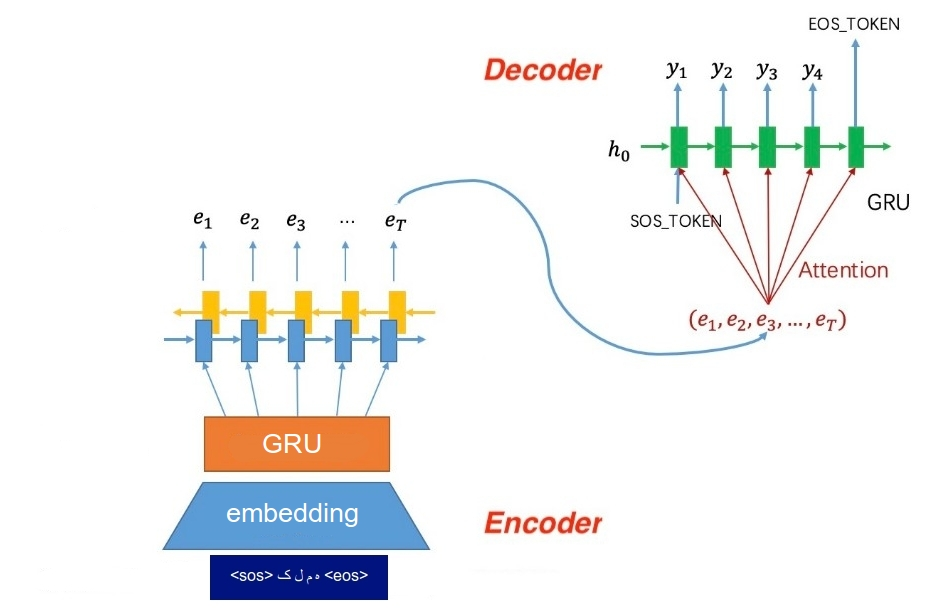

# Attention Based Grapheme To Phoneme
The G2P algorithm is used to generate the most probable pronunciation for a word not contained in the lexicon dictionary.
It could be used as [a preprocess of text-to-speech system](https://github.com/tihu-nlp/tihu/wiki/G2P) to generate pronunciation for OOV words.


## Dependencies
The following libraries are used:<br/>
pytorch<br/>
tqdm<br/>
matplotlib<br/>

Install dependencies using pip:
```
pip3 install -r requirements.txt
```


## Dataset
Currently the following languages are supported:
1. EN: English
2. FA: Farsi
3. RU: Russian

You could easily provide and use your own language specific pronunciatin doctionary for training G2P.
More details about data preparation and contribution could be found in ```resources```.<br/>
Feel free to provide resources for other languages.


## Attention Model
Both encoder-decoder seq2seq model and attention model could handle G2P problem.
Here we train attention based model.

The encoder model get sequence of graphemes and produces states at each timestep.
Encoder states used during attention decoding.
The decoder attends to appropriate encoder state (according to its state) and produces phonemes.


### Train
To start training the model run:
```
python train.py
```
You can also use tensorboard to check the training loss:
```
tensorboard --logdir log --bind_all
```
Training parameters could be found at ```config.py```.

### Test
To get pronunciation of a word:
```
# RU example
python test.py --word удалёнка
u0.d.a0.lj.o1.n.k.a0.<eos>
# EN example
python test.py --word PYTHON
P.IH.TH.AH.N.<eos>
# FA example
python test.py --word پایتون
p.A.y.t.o.n.<eos>
```
You could also visualize the attention weights, using ```--visualize```:
```
# RU example
python test.py --visualize --word удалёнка
u0.d.a0.lj.o1.n.k.a0.<eos>
# EN example
python test.py --visualize --word PYTHON
P.IH.TH.AH.N.<eos>
# FA example
python test.py --visualize --word پایتون
p.A.y.t.o.n.<eos>
```

## Other implementations
Also check [Persian_G2P](https://github.com/AzamRabiee/Persian_G2P), for encoder-decoder seq2seq model implementation.

